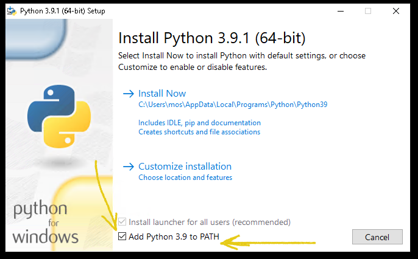
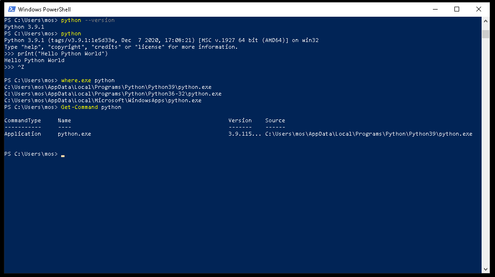
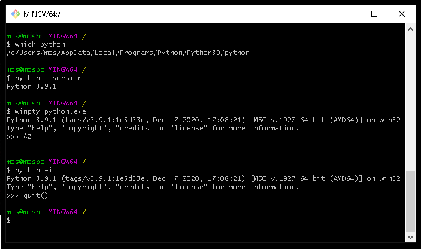

Questions and Answers (Q&A)
===========================

This is the Q&A section of thie exercise repo. It contains questions with answers and references of code samples, all useful when working with exercises within this repo.

[[_TOC_]]


Installation and development environment
---------------------------

This Q&A section is for installation procedures regarding the development environment.


### Install Python and execute it from PowerShell and Git Bash

When you download and install Python from the Python website you need to let the installation program know that you want the python executable to be in the system PATH so it can be found in any terminal.

It looks like this and there is a checkbox you must tick.



If you failed to do so you will not be able to run the command `python` from your terminal.

Then you need to reinstall python again, and ticking the box.

When you have finished the installation program you can start up a new shell for PowerShell (a new shell will have the new PATH settings) and check that the python command is working.

This is how I am checking it.



Now I can start a new shell of Git Bash. Remember that only a newly started shell will have the updated PATH environment variable set.



Notice that you need to execute `winpty python.exe` or `python -i` if you want to execute the python interpreter in Git Bash, otherwise it will just hang the terminal and you need to restart it.


Validation and Linters
---------------------------

This Q&A section is for validation and linters.


### You got a linter error D100, D400 or equal

You are having an error message from the linter called flake8. The error message is labeled D100 (D400) and is saying something about a docstring.

These types of error codes can be looked up and here is one place.

* http://www.pydocstyle.org/en/5.1.1/error_codes.html

**D100** - The error message is saying that it is missing the docstring on line 1, column 1 in that particular file.

**D400** - The docstring is a phrase ending in a period. It prescribes the function or method's effect as a command ("Do this", "Return that"), not as a description; e.g. don't write "Returns the pathname ...".

Open up the file on the line and column that the error message is stating. See if the error message makes sense - and then fix it - and rerun the linters.

The linter may be wrong, but it is usually right.

Doctring conventions are stated here, the linters follow those:

* https://www.python.org/dev/peps/pep-0257/


Unit testing
---------------------------

This Q&A section is about unit testing.


### Reach 100% coverage with '__name__ == "__main__"' code

> How are we supposed to reach 100% coverage with regard to the '__name__ == "__main__"' code? Are we supposed to reach 100% by excluding it from the coverage report?

Well, we can not really do that. So let see how it can be done...

My example programs contains the main-part as a convenience and to show that "you can also do like this". But those are not really needed  and it is really preferred to move that part out from the class and from the test_file.

For example, in the dice, I propose adding a `main.py` to make the dice class more clean.
We are not really interested in testing the `main.py`, so we can exclude that from our coverage. We are only interested in classes (and modules) as our main test objects,

> So we should move the 'name' == "main" code to the main.py

Yes. Do so. Rearrange the existing code to fit our needs.

I would do so myself. Makes things clearer.

I did a sample program in [`dice-with-main/`](questions-and-answers/dice-with-main), just to show a small example on how it can be done. This way you might also enable testing the main-function itself.

Here is an article on the topic "[Defining Main Functions in Python](https://realpython.com/python-main-function/)".


### How do we know that the unit tests are "correct"?

> I have a test suite for my code but how wo I know that the tests are actually correct and valid?

Well, that is a bit hard to say - how well are your unit tests actually testing your code and application logic?

The things we can measure and say something about could be:

1. Do all modules/classes have a corresponding test file (yes/no).
1. Coverage of the unit tests (do we have enough or reasonable coverage).
1. Does each testcase have at least one assertion (yes/no).

This does not say anything about how great our unit tests are, but it provides a base of sanity and a place to start.

It does not say how well are are testing the application logic.

It just says "we do have accurate unit tests and a proper coverage". Still, it is a good start.

We could further ask ourself, "how many tests are enough"?

1. There could be some guideline or metrics of this. If we for example compare the size of our application, with its complexity and the number of testcases and the coverage - that should give us a value. But this is perhaps something we might get into in the next part of the course, software quality metrics. We will find some values about this there.

So, you as a programmer should decide if you have tested each execution path in your program using your unit tests. Consider the following.

1. Test all possible execution paths.
1. Start with the ones that are the main execution paths that provide actual correct values.
1. Continue to add test cases to show that expected exceptions are raised. These are failure that you have handled in your code.
1. Continue with all the areas that migh go wrong (send in wrong arguments, wrong types of values) and see if your code deals with it.

Eventually you will say "this is enough".

Release your code and see if it works accordingly. If you get trouble reports on your code then perhaps you did not excel in the unit testing. Then just add more unit tests, correct the code, and release it again.

This were some notes and reasoning about what is wrong and right when it comes to the unit tests.


### What is a proper directory structure for Python projects?

> How should i setup the directory structure for my Python application and the unit tests?

If we do a investigation on how the community orders their directory structure we will find a couple of different solutions. Sometimes it relates to what type of application we are developing.

In the article "[Python Application Layouts: A Reference](https://realpython.com/python-application-layouts/)" the author outlines some different setups depending on the type of application. If we follow these guidelines we can create a similair basic structure.

It should be noted that it helps if you have knowledge on how Python Modules and Packages works. There is an article "[Python Modules and Packages – An Introduction](https://realpython.com/python-modules-packages/)" on that topic that you might wanna glance through.

Here I have organised the example program `guess` into a directory structure.

The original structure looks like this using the command `tree` which gives us a tree-like view of the directory structure.

```
$ tree -a .            
.                      
├── .flake8            
├── .pylintrc          
├── Makefile           
├── game.py            
├── game_test.py       
├── main.py            
└── shell.py           

0 directories, 7 files
```

The updated structure looks like this.

```
$ tree -a .              
.                        
├── .flake8              
├── .pylintrc            
├── Makefile             
├── guess                
│   ├── __init__.py      
│   ├── game.py          
│   ├── main.py          
│   └── shell.py         
├── requirements.txt     
└── test                 
    └── game_test.py     

2 directories, 9 files   
```

There are different structures and some use `src` and some do not. Here is an article "[Packaging a python library](https://blog.ionelmc.ro/2014/05/25/python-packaging/)" proposing to use the `src/`.

I my new structure the updated Makefile allow me to run both `make lint`, `make unittest` and `make coverage`. All these are gathered in the target `make test`.

```
$ make test                                                           
flake8                                                                
pylint */*.py                                                         

--------------------------------------------------------------------  
Your code has been rated at 10.00/10 (previous run: 10.00/10, +0.00)  

coverage run -m unittest discover test "*_test.py"                    
..                                                                    
----------------------------------------------------------------------
Ran 2 tests in 0.000s                                                 

OK                                                                    
coverage html                                                         
coverage report -m                                                    
Name                Stmts   Miss  Cover   Missing                     
-------------------------------------------------                     
guess/__init__.py       1      0   100%                               
guess/game.py          27     13    52%   26, 30, 34, 43-55           
test/game_test.py      16      1    94%   30                          
-------------------------------------------------                     
TOTAL                  44     14    68%                               
```

Now you have an embryo to a structure supporting a growing project. You can see its source in the directory  [`guess-as-directory-structure/`](questions-and-answers/guess-as-directory-structure).


### How to unittest a method that is printing a string to stdout?

The question and answer is defined in an issue:

* [How to unittest a method that is printing a string to stdout?](https://gitlab.com/mikael-roos/sustainable-programming-exercise/-/issues/4)


### How to unittest a method raising exceptions?

The question and answer is defined in an issue:

* [How to unittest a method raising exceptions?](https://gitlab.com/mikael-roos/sustainable-programming-exercise/-/issues/5)


### How to unittest a method doing random things?

The question and answer is defined in an issue:

* [How to unittest a method doing random things?](https://gitlab.com/mikael-roos/sustainable-programming-exercise/-/issues/6)


Python
---------------------------

This Q&A section is about Python.


### Read more on the Python language

There is a free book on Python where you can read up on the programming language and its constructs.

* [Python for Everybody](https://www.py4e.com/book)

The author of the book has recorded a [playlist of almost 100 videos  related to the book](https://www.youtube.com/playlist?list=PLlRFEj9H3Oj7Bp8-DfGpfAfDBiblRfl5p) and learning Python.


### Read more on object-orientation in Python

Here is a short article on "[Object-Oriented Programming (OOP) in Python 3
](https://realpython.com/python3-object-oriented-programming/)" which provides tha basics on creating and using a class in Python.

There is a free book "[Python 3 Object-Oriented Programming - Third Edition](https://www.packtpub.com/product/python-3-object-oriented-programming-third-edition/9781789615852)" providing further insights into the OO programming model of Python.

YouTube has a large selection on playlists and tutorials for "[Python OOP](https://www.youtube.com/results?search_query=python+oop)" if you prefer learning from videos.


### What is a class, a module and a API?

The question and answer is defined in an issue:

* [What is a class, a module and a API?](https://gitlab.com/mikael-roos/sustainable-programming-exercise/-/issues/3)


Group work
---------------------------

This Q&A section is about the group work.


### How to divide the work in the group when its hard?

The question and answer is defined in an issue:

* [How to divide the work in the group when its hard?](https://gitlab.com/mikael-roos/sustainable-programming-exercise/-/issues/2)
